IMPORTANT ❗ ❗ ❗ Please remember to destroy all the resources after each work session. You can recreate infrastructure by creating new PR and merging it to master.


                                                                                                                                                                                                                                                                                                                                                                                  
## Phase 1 Exercise Overview

  ```mermaid
  flowchart TD
      A[🔧 Step 0: Fork repository] --> B[🔧 Step 1: Environment variables\nexport TF_VAR_*]
      B --> C[🔧 Step 2: Bootstrap\nterraform init/apply\n→ GCP project + state bucket]
      C --> D[🔧 Step 3: Quota increase\nCPUS_ALL_REGIONS ≥ 24]
      D --> E[🔧 Step 4: CI/CD Bootstrap\nWorkload Identity Federation\n→ keyless auth GH→GCP]
      E --> F[🔧 Step 5: GitHub Secrets\nGCP_WORKLOAD_IDENTITY_*\nINFRACOST_API_KEY]
      F --> G[🔧 Step 6: pre-commit install]
      G --> H[🔧 Step 7: Push + PR + Merge\n→ release workflow\n→ terraform apply]

      H --> I{Infrastructure\nrunning on GCP}

      I --> J[📋 Task 3: Destroy\nGitHub Actions → workflow_dispatch]
      I --> K[📋 Task 4: New branch\nModify tasks-phase1.md\nPR → merge → new release]
      I --> L[📋 Task 5: Analyze Terraform\nterraform plan/graph\nDescribe selected module]
      I --> M[📋 Task 6: YARN UI\ngcloud compute ssh\nIAP tunnel → port 8088]
      I --> N[📋 Task 7: Architecture diagram\nService accounts + buckets]
      I --> O[📋 Task 8: Infracost\nUsage profiles for\nartifact_registry + storage_bucket]
      I --> P[📋 Task 9: Spark job fix\nAirflow UI → DAG → debug\nFix spark-job.py]
      I --> Q[📋 Task 10: BigQuery\nDataset + external table\non ORC files]
      I --> R[📋 Task 11: Spot instances\npreemptible_worker_config\nin Dataproc module]
      I --> S[📋 Task 12: Auto-destroy\nNew GH Actions workflow\nschedule + cleanup tag]

      style A fill:#4a9eff,color:#fff
      style B fill:#4a9eff,color:#fff
      style C fill:#4a9eff,color:#fff
      style D fill:#ff9f43,color:#fff
      style E fill:#4a9eff,color:#fff
      style F fill:#ff9f43,color:#fff
      style G fill:#4a9eff,color:#fff
      style H fill:#4a9eff,color:#fff
      style I fill:#2ed573,color:#fff
      style J fill:#a55eea,color:#fff
      style K fill:#a55eea,color:#fff
      style L fill:#a55eea,color:#fff
      style M fill:#a55eea,color:#fff
      style N fill:#a55eea,color:#fff
      style O fill:#a55eea,color:#fff
      style P fill:#a55eea,color:#fff
      style Q fill:#a55eea,color:#fff
      style R fill:#a55eea,color:#fff
      style S fill:#a55eea,color:#fff
```

  Legend

  - 🔵 Blue — setup steps (one-time configuration)
  - 🟠 Orange — manual steps (GCP Console / GitHub UI)
  - 🟢 Green — infrastructure ready
  - 🟣 Purple — tasks to complete and document in tasks-phase1.md

1. Authors:

   ***group nr: 13***

   ***link to forked repo: [https://github.com/Kapturz0ny/tbd-workshop-1](https://github.com/Kapturz0ny/tbd-workshop-1)***

2. Follow all steps in README.md.

3. From available Github Actions select and run destroy on master branch.

4. Create new git branch and:
    1. Modify tasks-phase1.md file.

    2. Create PR from this branch to **YOUR** master and merge it to make new release.

    ***place the screenshot from GA after successful application of release***
    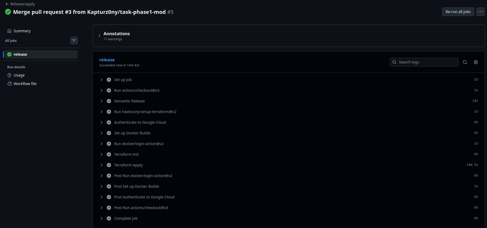


5. Analyze terraform code. Play with terraform plan, terraform graph to investigate different modules.

    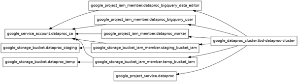

   Module: dataproc

   The dataproc module sets up a Spark/Hadoop cluster on Google Cloud. It automates the entire environment setup: enabling the required Google APIs, creating a dedicated Service Account for the cluster's identity, granting IAM permissions for BigQuery and worker nodes, and provisioning GCS buckets for staging and temporary data storage.


   The graph shows the dependency tree Terraform uses to determine the build order. The google_dataproc_cluster sits on the far right because it is the "final" resource. It depends on the API, the buckets, and all IAM permissions being fully active before it can successfully start.


7. Reach YARN UI

   ***place the command you used for setting up the tunnel, the port and the screenshot of YARN UI here***
   ```
   gcloud compute ssh tbd-cluster-m \
     --project=tbd-2026l-325143 \
     --zone=europe-west1-b \
     --tunnel-through-iap \
     -- -L 8088:localhost:8088
   ```
   
   Hint: the Dataproc cluster has `internal_ip_only = true`, so you need to use an IAP tunnel.
   See: `gcloud compute ssh` with `-- -L <local_port>:localhost:<remote_port>` and `--tunnel-through-iap` flag.
   YARN ResourceManager UI runs on port **8088**.
   
   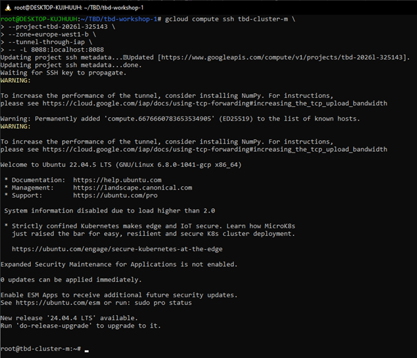
   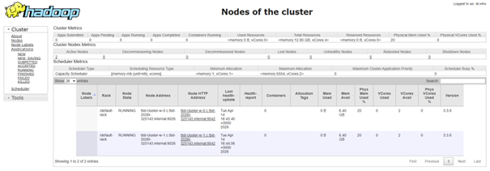

9. Draw an architecture diagram (e.g. in draw.io) that includes:
    1. Description of the components of service accounts
    2. List of buckets for disposal

    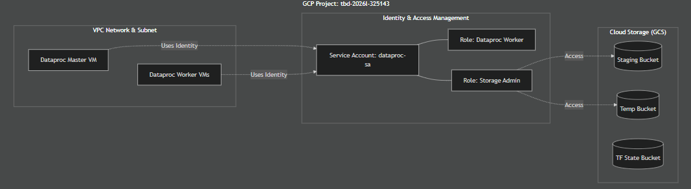

10. Create a new PR and add costs by entering the expected consumption into Infracost
For all the resources of type: `google_artifact_registry_repository`, `google_storage_bucket`
create a sample usage profiles and add it to the Infracost task in CI/CD pipeline. Usage file [example](https://github.com/infracost/infracost/blob/master/infracost-usage-example.yml)

   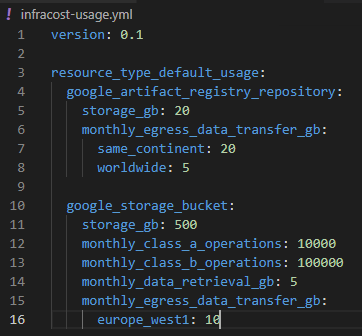

   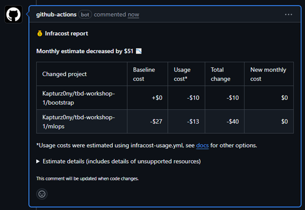

9. Find and correct the error in spark-job.py

    After `terraform apply` completes, connect to the Airflow cluster:
    ```bash
    gcloud container clusters get-credentials airflow-cluster --zone europe-west1-b --project PROJECT_NAME
    ```
    
    Then check the external IP (AIRFLOW_EXTERNAL_IP) of the webserver service:
    kubectl get svc -n airflow airflow-webserver                                                                                                                                                                 
                                              
                                                                                                                                                                                                               
    ▎ Note: If EXTERNAL-IP shows <pending>, wait a moment and retry — LoadBalancer IP allocation may take 1-2 minutes.  

    DAG files are synced automatically from your GitHub repo via git-sync sidecar.
    Airflow variables and the `google_cloud_default` GCP connection are also configured by Terraform.

    a) In the Airflow UI (http://AIRFLOW_EXTERNAL_IP:8080, login: admin/admin), find the `dataproc_job` DAG, unpause it and trigger it manually.

    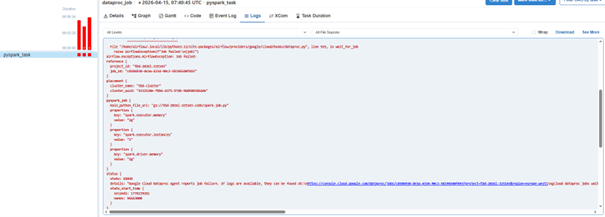

    b) The DAG will fail. Examine the task logs in the Airflow UI to find the root cause.
   
    Error message:
    ```
    status {
    state: ERROR
    details: "Google Cloud Dataproc Agent reports job failure. If logs are available, they can be found at:\nhttps://console.cloud.google.com/dataproc/jobs/c8586930-de3a-4334-90c3-58196540f493?project=tbd-2026l-325143&region=europe-west1\ngcloud dataproc jobs wait \'c8586930-de3a-4334-90c3-58196540f493\' --region \'europe-west1\' --project \'tbd-2026l-325143\'\nhttps://console.cloud.google.com/storage/browser/tbd-2026l-325143-dataproc-staging/google-cloud-dataproc-metainfo/9332520e-f8b6-4375-97db-9605003864de/jobs/c8586930-de3a-4334-90c3-58196540f493/\ngs://tbd-2026l-325143-dataproc-staging/google-cloud-dataproc-metainfo/9332520e-f8b6-4375-97db-9605003864de/jobs/c8586930-de3a-4334-90c3-58196540f493/driveroutput.*"
    state_start_time {
    seconds: 1776239261
    nanos: 96643000
      }
    }
    ```
    In logs from link from above error message:
    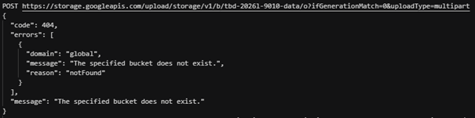
   
    In logs we can see attempt to write to bucket that does not exist. Issue was fixed by setting correct bucket in `modules/data-pipeline/resources/spark-job.py`:
   
   

    c) Fix the error in `modules/data-pipeline/resources/spark-job.py` and re-upload the file to GCS:
    ```bash
    gsutil cp modules/data-pipeline/resources/spark-job.py gs://PROJECT_NAME-code/spark-job.py
    ```
    Then trigger the DAG again from the Airflow UI.

   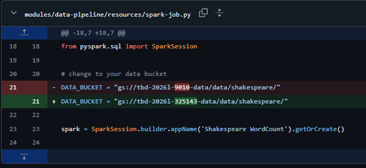

    [https://github.com/Kapturz0ny/tbd-workshop-1/blob/master/modules/data-pipeline/resources/spark-job.py]

    d) Verify the DAG completes successfully and check that ORC files were written to the data bucket:
    ```bash
    gsutil ls gs://PROJECT_NAME-data/data/shakespeare/
    ```

    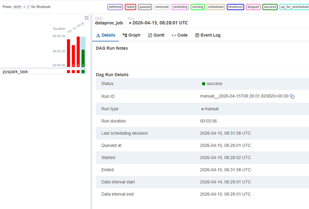

3.  Create a BigQuery dataset and an external table using SQL

    Using the ORC data produced by the Spark job in task 9, create a BigQuery dataset and an external table.

    Note: the dataset must be created in the same region as the GCS bucket (`europe-west1`), e.g.:
    ```bash
    bq mk --dataset --location=europe-west1 shakespeare
    ```

    SQL code:

    ```
    CREATE EXTERNAL TABLE `shakespeare.wordcount_results`
    OPTIONS (
      format = 'ORC',
      uris = ['gs://tbd-2026l-325143-data/data/shakespeare/*']
    )
    ```

    Example SQL query and output:

    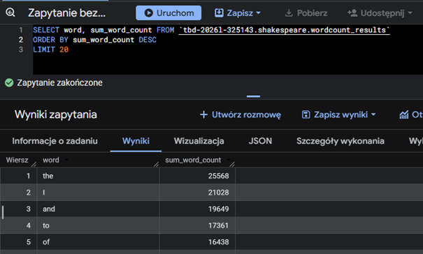

    ***why does ORC not require a table schema?***

    ORC is self-describing format that stores its own metadata, including column names and types within the file footer. Because of that BigQuery can automatically infer the schema directly from the files in GCS without manual configuration.

5.  Add support for preemptible/spot instances in a Dataproc cluster

    [https://github.com/Kapturz0ny/tbd-workshop-1/blob/master/modules/dataproc/main.tf]

    Inserted code:

    ```
    preemptible_worker_config {
      num_instances    = 2
      preemptibility   = "PREEMPTIBLE"
    }
    ```

    Result:

    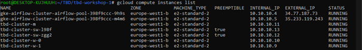

    
7.  Triggered Terraform Destroy on Schedule or After PR Merge. Goal: make sure we never forget to clean up resources and burn money.

Add a new GitHub Actions workflow that:
  1. runs terraform destroy -auto-approve
  2. triggers automatically:

   a) on a fixed schedule (e.g. every day at 20:00 UTC)

   b) when a PR is merged to master containing [CLEANUP] tag in title

Steps:
  1. Create file .github/workflows/auto-destroy.yml
  2. Configure it to authenticate and destroy Terraform resources
  3. Test the trigger (schedule or cleanup-tagged PR)

Hint: use the existing `.github/workflows/destroy.yml` as a starting point.

Created workflow: `auto-destroy.yaml`

```
name: Auto Destroy
on:
  schedule:
    - cron: '0 20 * * *'
  pull_request:
    types: [closed]
    branches:
      - master

permissions: read-all

jobs:
  auto-destroy-release:
    runs-on: ubuntu-latest
    permissions:
      contents: write
      id-token: write
      pull-requests: write
      issues: write

    if: >
      github.event_name == 'schedule' || 
      (github.event_name == 'pull_request' && github.event.pull_request.merged == true && contains(github.event.pull_request.title, '[CLEANUP]'))

    steps:
    - uses: 'actions/checkout@v3'
    
    - uses: hashicorp/setup-terraform@v2
      with:
        terraform_version: 1.11.0
        
    - id: 'auth'
      name: 'Authenticate to Google Cloud'
      uses: 'google-github-actions/auth@v1'
      with:
        token_format: 'access_token'
        workload_identity_provider: ${{ secrets.GCP_WORKLOAD_IDENTITY_PROVIDER_NAME }}
        service_account: ${{ secrets.GCP_WORKLOAD_IDENTITY_SA_EMAIL }}
        
    - name: Terraform Init
      id: init
      run: terraform init -backend-config=env/backend.tfvars
      
    - name: Terraform Destroy
      id: destroy
      run: terraform destroy -no-color -var-file env/project.tfvars -auto-approve
      continue-on-error: false
```

Testing the trigger by PR with tag:

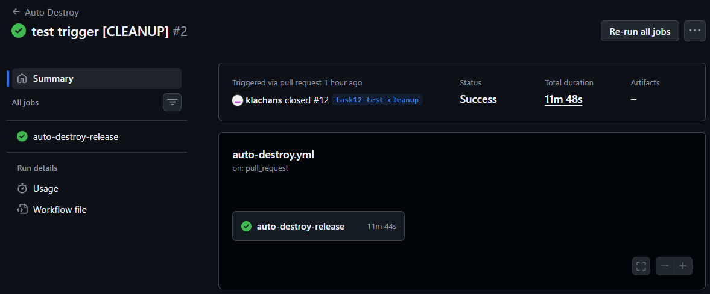

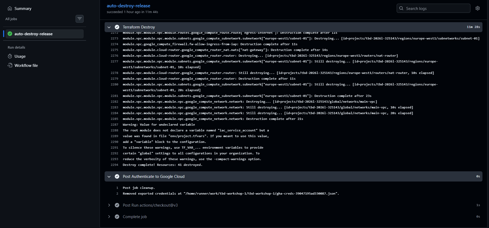

***write one sentence why scheduling cleanup helps in this workshop***

Scheduling cleanups ensures that cloud resources are not left running for no reason, preventing unnecessary consumption of project budget.

